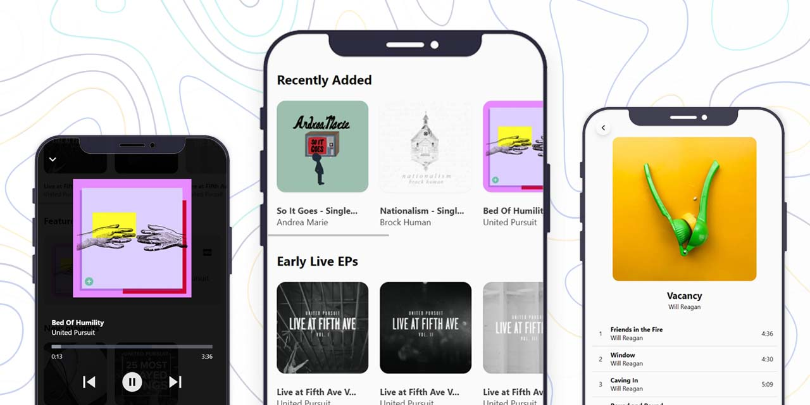
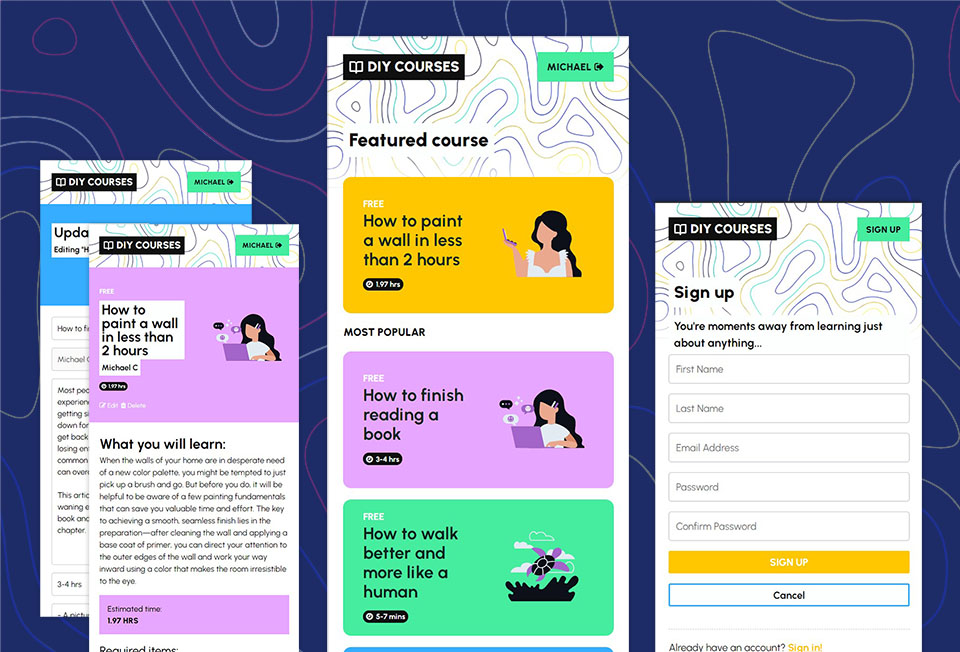
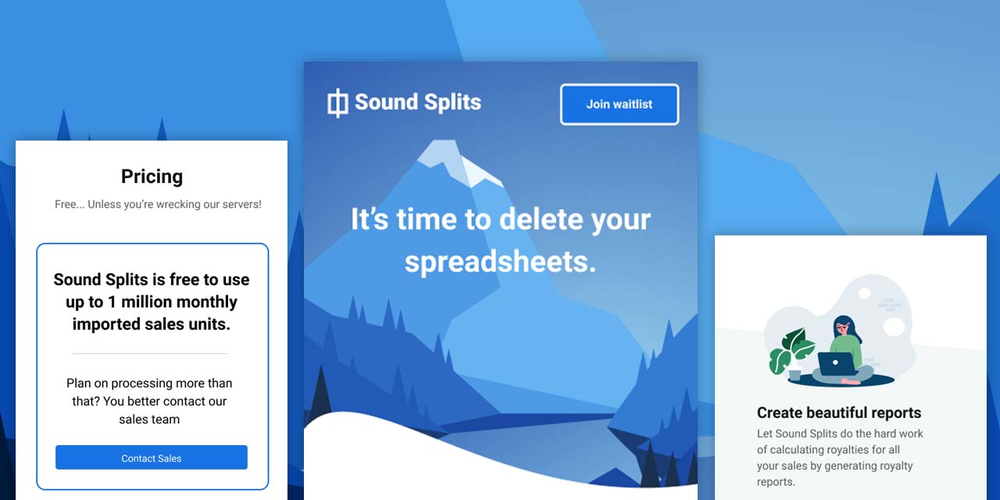

Hi there! :monocle_face:
Below you'll find some of my recent projects, live demos and source code available to browse. Currently, I'm building a SaaS product for the music industry that helps labels easily calculate and report their royalties. The codebase is private but check out it out at [soundsplits.com](https://www.soundsplits.com)

## Recent projects: 
- [Streamy - music streaming web app for United Pursuit Records](https://github.com/xyeres/streamy)
- [Courses - React client to consume my REST API](https://github.com/xyeres/courses-client)
- [Socketchat frontend client built on React and styled from scratch](https://github.com/xyeres/socketchat-client)
- [Socketchat backend - implemented with Express & Socket.io](https://github.com/xyeres/socketchat-server)
- [SoundSplits.com front page built with Tailwind CSS](https://github.com/mallocked/splits-landing)
- [Responsive accordion card built from scratch with semantic HTML & SCSS](https://github.com/xyeres/faq-accordion-card-main)
- [Accessible data usage component built with HTML & SCSS partials](https://github.com/xyeres/fylo-component)

### Keep in touch
⚡ [Connect with me on LinkedIn](https://www.linkedin.com/in/mxcarr/), message me and tell me about the projects you're currently working on!

Stay curious. Do good. 🔭✨ Let's make the web a better place for all.

### Recent project screenshots
[Streamy - music streaming web app for United Pursuit Records](https://github.com/xyeres/streamy)

[Courses client](https://github.com/xyeres/courses-client) - frontend React app that consumes my custom [REST API ](https://github.com/xyeres/courses-api)

Socketchat - chat app [client](https://github.com/xyeres/socketchat-client) and [backend](https://github.com/xyeres/socketchat-server):

[SoundSplits.com](https://github.com/mallocked/splits-landing) - UI design and implementation in Tailwind CSS

[FAQ accordion](https://github.com/xyeres/faq-accordion-card-main) - semantic html with responsive SCSS layout, accessible and screen reader friendly:

[Fylo component](https://github.com/xyeres/fylo-component) - An accessible, semantic Flexbox, SCSS, Keyframe animations UI component

<!--
- 🔭 I’m currently working on ...
- 🌱 I’m currently learning ...
- 👯 I’m looking to collaborate on ...
- 🤔 I’m looking for help with ...
- 💬 Ask me about ...
- 📫 How to reach me: ...
- 😄 Pronouns: ...
- ⚡ Fun fact: ...
-->
