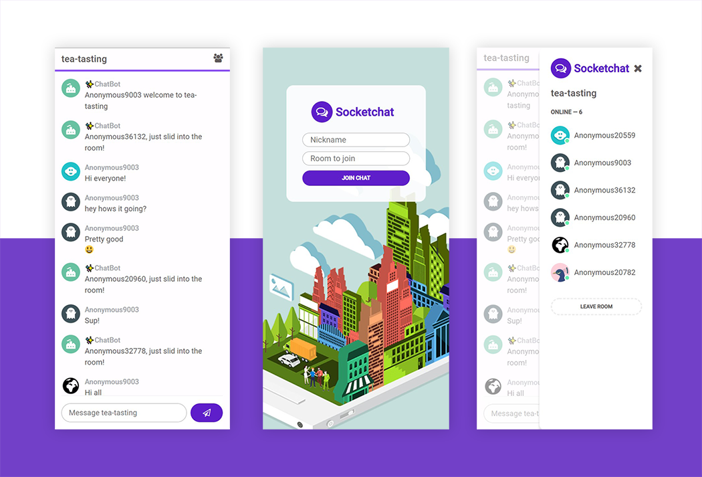
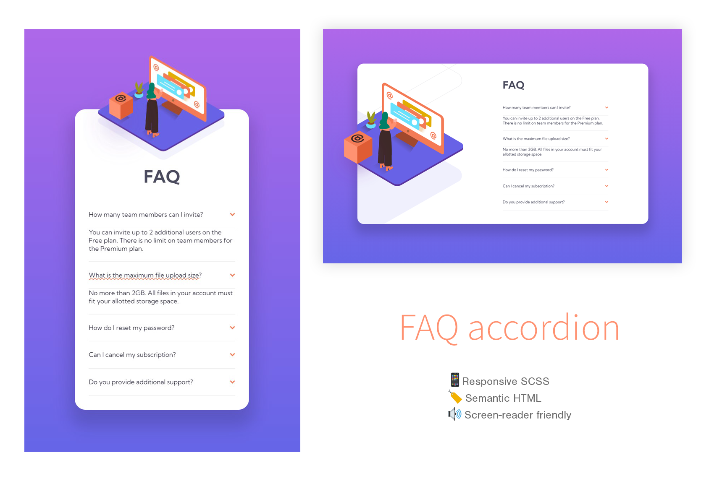
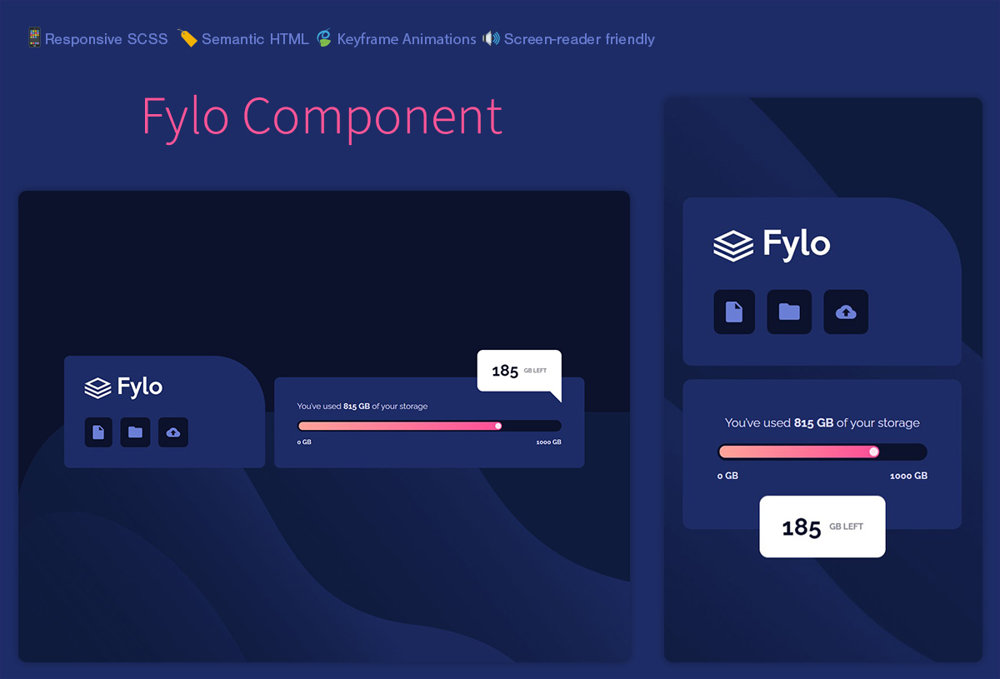

Below you'll find my recent projects, most of the source is open and I provide live demos of my work. Currently I'm building a SaaS for the music industry that helps labels easily calculate and report their royalties. The codebase is private but check it out live at [https://soundsplits.com](https://www.soundsplits.com)

## Recent projects to check out: 
- [Chat client frontend built on React and styled from scratch](https://github.com/xyeres/socketchat-client)
- [WebSocket chat server implemented with Express & Socket.io](https://github.com/xyeres/socketchat-server)
- [Responsive accordion card built from scratch with semantic HTML & SCSS](https://github.com/xyeres/faq-accordion-card-main)
- [Accessible data usage component built with HTML & SCSS partials](https://github.com/xyeres/fylo-component)

### Keep in touch
⚡ [Connect with me on LinkedIn](https://www.linkedin.com/in/mxcarr/), what projects are you currently working on?

### Recent project screenshots
Socketchat - chat app [client](https://github.com/xyeres/socketchat-client) and [backend](https://github.com/xyeres/socketchat-server):

[FAQ accordion](https://github.com/xyeres/faq-accordion-card-main) - semantic html with responsive SCSS layout, accessible and screen reader friendly:

[Fylo component](https://github.com/xyeres/fylo-component) - An accessible, semantic Flexbox, SCSS, Keyframe animations UI component

Stay curious. Do good. 🔭✨
<!--
- 🔭 I’m currently working on ...
- 🌱 I’m currently learning ...
- 👯 I’m looking to collaborate on ...
- 🤔 I’m looking for help with ...
- 💬 Ask me about ...
- 📫 How to reach me: ...
- 😄 Pronouns: ...
- ⚡ Fun fact: ...
-->
